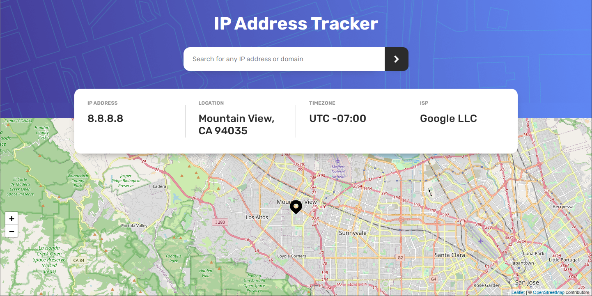
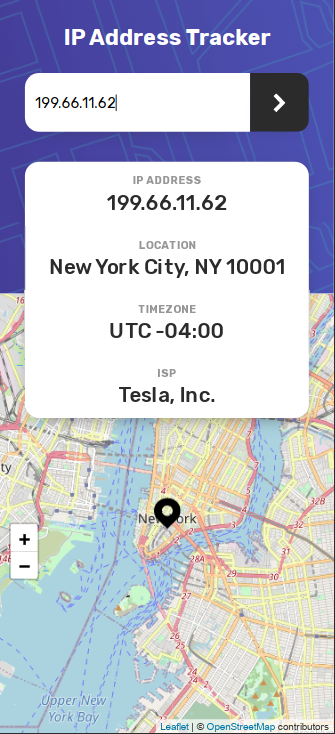

# Frontend Mentor - IP address tracker solution

This is a solution to the [IP address tracker challenge on Frontend Mentor](https://www.frontendmentor.io/challenges/ip-address-tracker-I8-0yYAH0). 

This project was bootstrapped with [Create React App](https://github.com/facebook/create-react-app).

## Table of contents

- [Overview](#overview)
  - [The challenge](#the-challenge)
  - [Links](#links)
  - [Screenshot](#screenshot)
- [My process](#my-process)
  - [Built with](#built-with)
  - [What I learned](#what-i-learned)
  - [Continued development](#continued-development)
- [Author](#author)

## Overview

### The challenge

Users should be able to:

- View the optimal layout for each page depending on their device's screen size
- See hover states for all interactive elements on the page
- See their own IP address on the map on the initial page load
- Search for any IP addresses or domains and see the key information and location

### Links
- Solution URL: https://github.com/miguellangel/ip-address-tracker
- Live Site URL: https://miguellangel.github.io/ip-address-tracker
### Screenshot 

## My process
- I started with the design and later applied the functionality. 

### Built with
- React
- JSX Components
- No bootstrap for simplicity
- SCSS, mixins, and custom variables
- Flexbox, Grid
- Semantic HTML5 Markup
- React-Leaflet
- IPfy API
- Node modules to hide the API key

### What I learned
- Discovered how easy-to-use Flexbox is. Was previously using grid only
- Got more familiar with Fetch
- Learned how to hide API keys in .env
- Discovered and worked around some CSS quirks
- how React useMemo works, but realized it wasn't needed in my project

### Continued development
- I want to be able to better identify when Flexbox over Grid is preferable

## Author
- Website - [Miguel Arriaga](miguellangel.github.io)
- Frontend Mentor - [@miguellangel](https://www.frontendmentor.io/profile/miguellangel)
